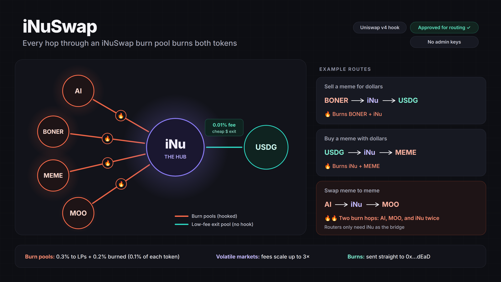

# iNuSwap



Uniswap v4 burn pools on **Robinhood Chain** that make **iNu the hub of the [Long.xyz](https://long.xyz) ecosystem**.

**Why it matters**
- **For every LONG token:** each trade through an iNuSwap pool burns 0.1% of *both* tokens, so every listed project's supply shrinks with volume, not just iNu's.
- **For iNu:** iNu sits in the middle of every route. BONER → iNu → USDG, USDG → iNu → MEME, AI → iNu → MOO: routers only need iNu to connect any two LONG tokens. A meme-to-meme swap crosses two burn pools, so iNu is burned twice.
- **For LPs:** 0.3% to LPs when the market is calm, and fees rise up to 3× in volatile markets, when LPs need protection most.
- **Trustless:** no owner, no admin keys, no upgrades. The source is verified and the hook is approved for Uniswap routing.

**The exit pool pulls trades into the burn pools.** Most traders buy and sell LONG tokens with dollars. The [iNu/USDG exit pool](https://app.uniswap.org/explore/pools/robinhood/0xe26776339ac6fe3f8f9fe2ba2d4e36eaffa9c5a71d65f01832324f28b7873dd5) charges only 0.05%, so the dollar leg through iNu is nearly free. That makes routes like **BONER → iNu → USDG** and **USDG → iNu → MEME** competitive with each token's own pools. When a router picks that path, the trade passes through a burn pool and burns both tokens on the way. The cheaper the exit, the more everyday buys and sells route through iNu.

Anyone can create a pool on the hook, for any pair.

## Pools

**Burn pools (on the hook):**

| Pool | Uniswap | Pool ID | Created |
|---|---|---|---|
| INU /AI | [pool](https://app.uniswap.org/explore/pools/robinhood/0xece5b96aee6848dd9c0c549e8700878be0cfbaf07ef676e829e33a99fc3e35ad) | `0xece5b96aee6848dd9c0c549e8700878be0cfbaf07ef676e829e33a99fc3e35ad` | [tx](https://robinhoodchain.blockscout.com/tx/0xde78c49ba0a9b38af6a8d6953eb93a5e519492abaf76f6447d6f521f46688178) |
| INU / BONER | [pool](https://app.uniswap.org/explore/pools/robinhood/0x2644f63be98e71236db9cfabbcce0a05c489d8a9154ed72b399807567b224e5b) | `0x2644f63be98e71236db9cfabbcce0a05c489d8a9154ed72b399807567b224e5b` | [tx](https://robinhoodchain.blockscout.com/tx/0x9e1649ed83fad9a8749da99f2f7af85f6e3997f430fe35262a8b46ec33c738fb) |
| INU / MEME | [pool](https://app.uniswap.org/explore/pools/robinhood/0x4b5491ed69d6e49259f714b72b09f153742628bb48377aaeb1bfdc1b829fb269) | `0x4b5491ed69d6e49259f714b72b09f153742628bb48377aaeb1bfdc1b829fb269` | [tx](https://robinhoodchain.blockscout.com/tx/0x689014ffec83df4a5ece562e189feaf707846aa000ef20d538a478a6882573a2) |
| INU / MOO | [pool](https://app.uniswap.org/explore/pools/robinhood/0x52904913001b1c7cf60a3cff1696f64f9b14fe6be3e0198811de6506e5d1f403) | `0x52904913001b1c7cf60a3cff1696f64f9b14fe6be3e0198811de6506e5d1f403` | [tx](https://robinhoodchain.blockscout.com/tx/0xc494a856595f058438931f21650949750519eaa2e3e4a1931775b5620bf01e8d) |

**Exit pool (no hook, no burn):**

| Pool | Uniswap | Pool ID | Fee |
|---|---|---|---|
| USDG / INU | [pool](https://app.uniswap.org/explore/pools/robinhood/0xe26776339ac6fe3f8f9fe2ba2d4e36eaffa9c5a71d65f01832324f28b7873dd5) | `0xe26776339ac6fe3f8f9fe2ba2d4e36eaffa9c5a71d65f01832324f28b7873dd5` | 0.05% |

The exit pool is deliberately cheap and unhooked: it's the on-ramp and off-ramp that feeds dollar trades into the burn pools above.

- **Hook:** [`0xac5187fA1FFBD9882cE6Eba5B29aA0A6692e50Cc`](https://robinhoodchain.blockscout.com/address/0xac5187fA1FFBD9882cE6Eba5B29aA0A6692e50Cc?tab=contract). The source is verified, and it's on Uniswap's routing allowlist.
- **Burn totals:** read [`totalBurned(token)` / `burnedByPool(poolId, token)`](https://robinhoodchain.blockscout.com/address/0xac5187fA1FFBD9882cE6Eba5B29aA0A6692e50Cc?tab=read_contract), or check the [event log](https://robinhoodchain.blockscout.com/address/0xac5187fA1FFBD9882cE6Eba5B29aA0A6692e50Cc?tab=logs).
- **Pool settings:** dynamic fee (`0x800000`), tick spacing 60, and the hook above.

## Adding liquidity

1. Open a pool's **Uniswap** link above and click **Add liquidity**. Connect a wallet on Robinhood Chain.
2. Choose **Full range**, which is recommended so the position always earns. Enter an amount of one token and the other fills in.
3. Approve and confirm. You'll earn the LP fee (0.3% of each swap, up to 0.9% in volatile markets) and can withdraw anytime from **Positions**.

Uniswap may flag the pool as using a custom hook. That's expected.

## Fees

Each swap pays an LP fee (kept by liquidity providers, as in any Uniswap pool) and a burn fee, both scaled by a volatility multiplier:

| Market | Multiplier | LP fee | Burn (input + output) | Total |
|---|---|---|---|---|
| Calm | 1× | 0.30% | 0.10% + 0.10% | 0.5% |
| Choppy | 2× | 0.60% | 0.20% + 0.20% | 1.0% |
| Wild | 3× | 0.90% | 0.30% + 0.30% | 1.5% |

**How volatility is measured:** the hook keeps a slow-moving *reference price* for each pool. The multiplier depends on how far the live price is from it:

- under 300 ticks (~3%): 1×
- under 950 ticks (~10%): 2×
- anything larger: 3×

The gap is measured *before* each swap runs, so a trade can't set its own fee. The gap halves every 512 seconds (~8.5 minutes), whether there is one swap in that time or a thousand. A 10% move is back to 1× in about 15 minutes.

**How the burn works:** there's no fee pot, no keeper and no separate buyback swap, so there's nothing for bots to front-run.

- In `beforeSwap`, the hook takes 0.1% × multiplier of the specified token straight to the dead address.
- In `afterSwap`, it does the same with the other token.

On-chain counters `totalBurned(token)` and `burnedByPool(poolId, token)` track totals, along with `Burned` and `FeeApplied` events.

## Repository layout

```
src/INuSwapHook.sol              The hook
script/Addresses.sol             Every chain / token address (edit this to add tokens)
script/DeployHook.s.sol          Mines a CREATE2 salt for the hook's permission bits and deploys it
script/CreatePool.s.sol          Creates one iNu/X pool and seeds full-range liquidity in one transaction
script/HookMiner.sol             Salt miner (from Uniswap v4-periphery)
script/PriceRoute.sol            Chains live pool prices to price a pair with no direct pool
script/PoolInfo.s.sol            Read-only: price, tick and liquidity for any pool ids
test/INuSwapHook.t.sol           Local tests against a fresh v4 deployment with mock tokens
test/fork/INuSwapHook.fork.t.sol Hook tests against the real Robinhood Chain contracts (forked)
test/fork/TokenChecks.t.sol      Confirms each token is a plain ERC-20 (no transfer tax, no rebasing, can burn)
test/fork/PriceRoute.fork.t.sol  Checks every launch-price route against live pools
```

## Setup

Requires [Foundry](https://book.getfoundry.sh/getting-started/installation).

```bash
git clone --recursive <repo-url> && cd <repo>
# already cloned without --recursive?
git submodule update --init --recursive

forge build
```

Create a `.env` file in the project root (it's gitignored):

```
ROBINHOOD_RPC_URL=https://robinhood-mainnet.g.alchemy.com/v2/<YOUR_KEY>
```

The public RPC (`https://rpc.mainnet.chain.robinhood.com`) also works, but it is rate limited.

## Testing

```bash
forge test                                # everything (fork tests read ROBINHOOD_RPC_URL from .env)
forge test --match-path test/INuSwapHook.t.sol   # local only, no RPC needed
forge test --match-path 'test/fork/*' -vv        # fork tests only
```

Fork tests copy the live chain state locally and run against the real PoolManager, PositionManager, Permit2 and tokens. They need no gas, no ETH and no wallet, and nothing is sent on-chain.

## Deploying

### 1. Set up the deployer wallet

Use a fresh wallet that holds only a little ETH plus the tokens you'll seed. Import its key into Foundry's encrypted keystore. The key is never stored in plain text or in `.env`.

```bash
cast wallet import deployer --interactive
cast wallet address --account deployer   # confirm the address
```

### 2. Rehearse on a local fork (optional, free)

```bash
anvil --fork-url $ROBINHOOD_RPC_URL --port 8547
# in another terminal, use anvil's unlocked test account:
forge script script/DeployHook.s.sol --rpc-url http://127.0.0.1:8547 \
  --sender 0xf39Fd6e51aad88F6F4ce6aB8827279cffFb92266 --unlocked --broadcast
```

### 3. Deploy the hook

```bash
# dry run: simulates and prints the hook address and gas, sends nothing
forge script script/DeployHook.s.sol --rpc-url robinhood --sender <deployer-address>

# for real
forge script script/DeployHook.s.sol --rpc-url robinhood --account deployer --broadcast
```

Deploying costs about 1.5M gas, well under $1 at current Robinhood Chain gas prices. Then put the address in `Addresses.HOOK` and publish the source so anyone can read it. Blockscout's API is behind a Cloudflare challenge, so verify through Sourcify, which Blockscout reads from:

```bash
forge verify-contract <hook-address> src/INuSwapHook.sol:INuSwapHook --chain-id 4663 --verifier sourcify \
  --constructor-args $(cast abi-encode "constructor(address)" 0x8366a39CC670B4001A1121B8F6A443A643e40951) --watch
```

### 4. Create a pool

The script handles all of the following:

- **Pair:** sorts the two tokens.
- **Price:** reads the market price live along a route of existing pools (for example INU → AI → BONER). You never enter a price.
- **Launch:** creates the pool and adds full-range liquidity in one transaction, so nobody can create the pool first at a bad price.
- **Check:** confirms afterwards that the pool matches the market price and launched at 1× fees.

```bash
# dry run
TOKEN=AI AMOUNT_INU=<wei> AMOUNT_TOKEN=<wei> \
  forge script script/CreatePool.s.sol --rpc-url robinhood --sender <deployer-address>

# for real: same settings, plus
  --account deployer --broadcast
```

`AMOUNT_INU` and `AMOUNT_TOKEN` are upper limits. The script deposits in the market ratio and never spends more than either amount. Create one pool first, check it, then do the rest.

### 5. Verify on-chain

- The hook address's low 14 bits are `0x10CC`: its permission flags.
- `hook.currentFees(key)` returns multiplier `1`, LP fee `3000` and burn fee `2000`.
- After a small test swap, `totalBurned` goes up for both tokens, and so does the dead address's balance.

## Reading on-chain values


- **Raw units:** Blockscout's Read contract shows raw token units. LONG tokens use 18 decimals, so `187979629532859129` means 0.1880 INU.
- **Uniswap UI dollar values:** unreliable for these new, small pools. It once showed a $15 fee on a trade that earned $0.006. Trust the on-chain numbers.
- **Any pool's price and liquidity:** `POOLS=<id>,<id> forge script script/PoolInfo.s.sol --rpc-url robinhood`
- **LP fees:** they stay inside the PoolManager until the position collects them or withdraws.
- **Log searches (`cast logs`):** use the public RPC (`https://rpc.mainnet.chain.robinhood.com`). Alchemy's free tier limits `eth_getLogs` to 10 blocks and returns nothing useful beyond that.

## Addresses (Robinhood Chain, chain ID 4663)

| | Address |
|---|---|
| PoolManager | `0x8366a39CC670B4001A1121B8F6A443A643e40951` |
| PositionManager | `0x58daec3116aae6D93017bAAea7749052E8a04fA7` |
| Permit2 | `0x000000000022D473030F116dDEE9F6B43aC78BA3` |
| CREATE2 deployer | `0x4e59b44847b379578588920cA78FbF26c0B4956C` |
| **iNuSwap hook** | `0xac5187fA1FFBD9882cE6Eba5B29aA0A6692e50Cc` (verified on Sourcify) |
| INU | `0x63Ee32Ac3077d1fbd8a77eBBA2a6ed4b8e9c1e18` |
| AI | `0x2E8c31162b855A2ffa90F6F8634643Ad6F111e18` |
| BONER | `0x98096d17e191B3dA1d5f99a6D7b3584351b11E18` |
| MEME | `0x385F4f8ae47651ce5F58F5265395a669f8281e18` |
| MOO | `0xD9dB30BB0D2b8d2eae3826A1372117E058791e18` |

Explorer: https://robinhoodchain.blockscout.com

### Adding a token

In `script/Addresses.sol`, add a constant for it, then add it to `partners()` and `partner()`. Run `forge test --match-path test/fork/TokenChecks.t.sol` to confirm it's a plain ERC-20. Then give it a price route in `priceRoute()`: usually INU → AI → X through the deepest X/AI pool, the way BONER, MEME and MOO are priced. `test/fork/PriceRoute.fork.t.sol` checks each route against an independent calculation.

## Risks

- **Unaudited.** Seed small amounts until the pools have been running for a while.
- **Parameters are permanent.** There is no admin, so changing a fee means deploying a new hook and new pools.
- **Thin liquidity.** Routers only send trades here when the price is competitive, so depth matters more than the fee level.
- **Up to 1.5% fees during crashes** push some volume to other pools. That's intended: it protects LPs.
- **Non-standard tokens** (transfer tax, rebasing, blocklists) break v4 accounting. Check every new token.
- **Robinhood runs the sequencer.** It can delay transactions but can't fake results.
